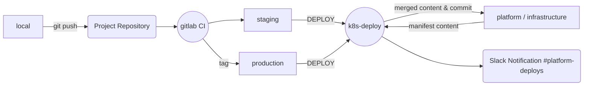

# Kotlin Template Service

This template works as a guide for developers who wants to apply 
good practices and the latest technology for building microservices.

## Dependencies
| Name       | Version |
|------------|---------|
| Gradle     | [5.4.1](https://github.com/gradle/gradle/releases/tag/v5.4.1)   |
| Kotlin     | [1.3.31](https://github.com/JetBrains/kotlin/releases/tag/v1.3.31)  |
| Spek       | [2.0.2](https://github.com/spekframework/spek/releases/tag/2.0.2)   |
| Log4J      | [2.11.2](https://github.com/apache/logging-log4j2/releases/tag/log4j-2.11.2)  |
| Vertx      | [3.7.0](https://github.com/eclipse-vertx/vert.x/releases/tag/3.7.0)   |
| RxKotlin   | [2.3.0](https://github.com/ReactiveX/RxKotlin/releases/tag/2.3.0)   |
| Micrometer Metrics Prometheus | [1.1.4](https://github.com/micrometer-metrics/micrometer/releases/tag/v1.1.4)   |

## Environment Variables
```
PORT /* Listen HTTP port. Default: 8080 */
ENABLE_SENTRY /* 'true' or 'false'. Default: 'false' */
ENABLE_NEWRELIC /* 'true' or 'false'. Default: 'false' */
SENTRY_DSN /* DSN configured for Sentry to send logs from your app*/
NEWRELIC_ENVIRONMENT /* 'staging' or 'production'. Default: 'production' */
```

## CLI
We included a basic cli `service-template-cli.sh` that helps you overriding things such as service name and packages based on your needs.

## Testing Framework
We decided to use ***Spek*** as our default testing framework due to its expressiveness and ease to use. The style adopted by this project is [Gherkin]('https://spekframework.org/gherkin/').

## Workflow


## New naming convention in ingress files.
`ingress-public.yml` and `ingress-private.yml` are the files we encourage you to use in your project when you're working with ingress files. `ingress-private.yml` will be validated using the **ipwhitelist** policy while `ingress-public.yml` will gain open access using the **always_true** policy.

## Kustomize support
Kotlin-Template v1.1.0 supports [Kustomize](https://kustomize.io) by default. For that reason the .k8s folder structure is a little bit different from previous version. Kustomize is a tool that helps you configuring, customizing and reusing your configuration yaml files.

Note: If for some reason you need to support the previous structure of .k8s you should use k8s-deploy `--disable-kustomize` flag.

## .k8s folder
.k8s folder contains infrastructure information about your project. At the moment of pushing or tagging your repository the ci pipeline will get the staging/production folder and merge it with the infrastructure repository. Therefore these new modifications will be applied automatically on kubernetes cluster.


- `k8s-deploy` tool used by gitlab-ci to deploy the project.
- `base/` Common files shared by the different environments.
    
    - **kustomization.yml** list the resources that kustomize should be applied when it's called.
    - `manifests/`
        - **deployment.yml:** provides declarative updates for Pods and ReplicaSets.
        - **service.yml:** abstraction which defines a logical set of Pods and a policy by which to access them
        - **ingress-*.yml:** API object that manages external access to the services in a cluster, typically HTTP.
        - **service-monitor.yml:** define metric endpoint autoconfiguration for prometheus monitoring

- `staging/production folder`
    - **kustomization.yml** Describes which patches should be applied and how.
    - **deployment.yml** Deployment patch file with particular information of the environment.
    - **ingress-host-patch.yml** Patch for HOST replacement in ingress files.


## Endpoints

```
GET /info
```
> Response **200 OK**
```json
[
  {
    "name": "gradle",
    "version": "5.4.1",
    "url": "https://github.com/gradle/gradle/releases/tag/v5.4.1"
  },
  {
    "name": "Kotlin",
    "version": "1.3.31",
    "url": "https://github.com/JetBrains/kotlin/releases/tag/v1.3.31"
  },
  {
    "name": "Spek",
    "version": "2.0.2",
    "url": "https://github.com/spekframework/spek/releases/tag/2.0.2"
  },
  {
    "name": "Log4J",
    "version": "2.11.2",
    "url": "https://github.com/apache/logging-log4j2/releases/tag/log4j-2.11.2"
  },
  {
    "name": "Vertx",
    "version": "3.7.0",
    "url": "https://github.com/eclipse-vertx/vert.x/releases/tag/3.7.0"
  },
  {
    "name": "RxKotlin",
    "version": "2.3.0",
    "url": "https://github.com/ReactiveX/RxKotlin/releases/tag/2.3.0"
  },
  {
    "name": "Micrometer Metrics Prometheus",
    "version": "1.1.4",
    "url": "https://github.com/micrometer-metrics/micrometer/releases/tag/v1.1.4"
  }
]
```

---

```
GET /health
```
> Response **200 OK**
```json
{
  "status": "healthy"
}
```

---

```
GET /metrics
```
> Response **200 OK**
```plain/text
# HELP vertx_http_server_bytesSent Number of bytes sent by the server
# TYPE vertx_http_server_bytesSent summary
vertx_http_server_bytesSent_count 1.0
vertx_http_server_bytesSent_sum 36.0
# HELP vertx_http_server_bytesSent_max Number of bytes sent by the server
# TYPE vertx_http_server_bytesSent_max gauge
vertx_http_server_bytesSent_max 36.0
...
```

---

```
GET /kotlin-template/greet/:lang 

Accepted lang values -> "en"
```

> Response **200 OK**
```json
{
    "greeting": "Hello, Platform"
}
```

> Response **404 Not Found**
```json
{
  "error": "Greetings Not Found"
}
```
